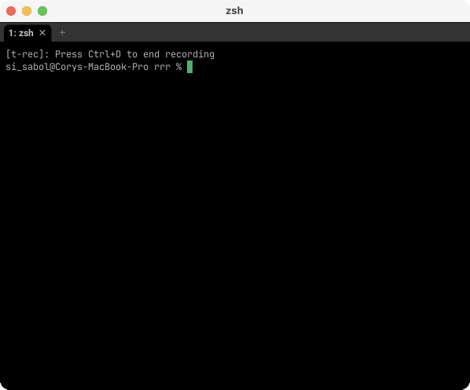

# rrr (Really Rapid Requestor) 🚀

<p align="center">
  
</p>

rrr is a CLI tool designed to fetch a bunch of URLs rapidly. That's pretty much it. It can save responses to files in a folder, or output them to STDOUT for piping.
Inspired by [tomnomnom's fff](https://github.com/tomnomnom/fff).

## Features 🌟
- **Custom HTTP Methods**: Choose the HTTP method for your requests.
- **Save Responses**: Automatically save response bodies to a specified directory.
- **Ignore Specific Status Codes**: Skip processing responses with certain HTTP status codes.
- **STDOUT Output**: Directly print response bodies to STDOUT for further processing.

## Usage 🛠

```
rrr (really rapid requesor) is a simple tool to rapidly request URLs.

Usage: rrr [OPTIONS]

Options:
  -m, --method <METHOD>        Optional HTTP method to use for requests [default: GET]
  -t, --timeout <TIMEOUT>      Request timeout value in milliseconds, e.g. 5000 = 5s [default: 5000]
  -d, --directory <DIRECTORY>  Optional directory to save response bodies to [default: responses]
  -i, --ignore <IGNORE>        Optional list of HTTP response status codes to ignore e.g. 404,403,500
  -o, --stdout                 Print responses to STDOUT
  -h, --help                   Print help
  -V, --version                Print version

Examples:
    cat ranges.txt | httpx | rrr -d responses
    cat urls.txt | rrr -i 404,403,500 -o > responses.txt
    cat ranges.txt | daship | httpx | rrr -o | rg "hackme" > intersting.txt
    echo 'https://foo.com' | rrr --timeout 1000
```

### Examples:

- Chain with other tools and save responses:
    ```
    cat ranges.txt | httpx | rrr -d responses
    ```
- Filter out specific status codes and print responses:
    ```
    cat urls.txt | rrr -i 404,403,500 -o > responses.txt
    ```
- Find interesting responses by piping to tools like Ripgrep:
    ```
    cat ranges.txt | daship | httpx | rrr -o | rg "hackme" > interesting.txt
    ```

## Get Started 🔥

### Install Prebuilt Binaries (recommended)
Grab the prebuilt binary for your OS from the [releases](https://github.com/corysabol/rrr/releases).

### Install From Source
Ensure you have Rust installed, then clone the repo, install with `cargo install --path .`.


Happy requesting! 🌐✨
